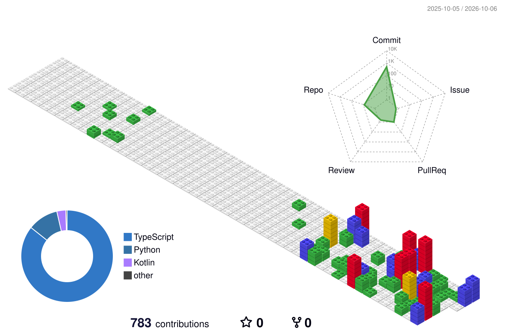
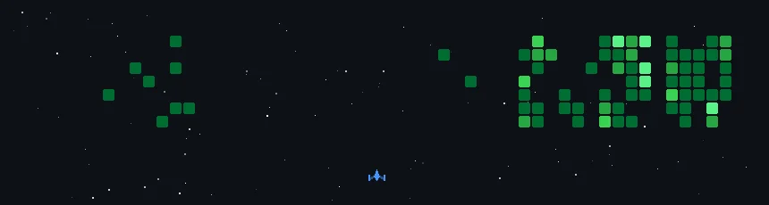

<!-- ===== Typing header =====  EDIT the lines= text below (keep +/;/%.. encoding) -->
<a href="https://github.com/rauniyar-aman">
  <picture>
    <source media="(prefers-color-scheme: dark)" srcset="https://readme-typing-svg.demolab.com?font=Fira+Code&weight=600&size=28&pause=1000&center=true&vCenter=true&width=700&height=55&color=EBEBEB&lines=Hi+%F0%9F%91%8B+I%27m+Aman+Rauniyar;Full-Stack+Developer;Always+learning+something+new+%F0%9F%9A%80" />
    <source media="(prefers-color-scheme: light)" srcset="https://readme-typing-svg.demolab.com?font=Fira+Code&weight=600&size=28&pause=1000&center=true&vCenter=true&width=700&height=55&color=000000&lines=Hi+%F0%9F%91%8B+I%27m+Aman+Rauniyar;Full-Stack+Developer;Always+learning+something+new+%F0%9F%9A%80" />
    
  </picture>
</a>

<!-- ===== Social / contact badges =====  EDIT the href="#" URLs below -->

  
  
  
  
  

<!-- ===== About Me =====  EDIT the bullets below -->
## 👨‍💻 About Me

- 🔭 I’m currently working on **your current project**
- 🌱 I’m currently learning **things you’re learning**
- 💬 Ask me about **your topics**
- 📫 How to reach me: **you@example.com**
- ⚡ Fun fact: **your fun fact**

<!-- ===== Tech Stack =====  EDIT the i= icon list (see https://skillicons.dev) -->
### 🛠️ Tech Stack

<picture>
  <source media="(prefers-color-scheme: dark)" srcset="https://skillicons.dev/icons?i=html,css,js,ts,react,nodejs,python,git,github,vscode&theme=dark" />
  <source media="(prefers-color-scheme: light)" srcset="https://skillicons.dev/icons?i=html,css,js,ts,react,nodejs,python,git,github,vscode&theme=light" />
  
</picture>

  

<!-- ===== GitHub stats badges ===== -->

<!-- Profile details -->
<picture>
  <source media="(prefers-color-scheme: dark)" srcset="https://github-profile-summary-cards.vercel.app/api/cards/profile-details?username=rauniyar-aman&theme=dark&hide_border=true" />
  <source media="(prefers-color-scheme: light)" srcset="https://github-profile-summary-cards.vercel.app/api/cards/profile-details?username=rauniyar-aman&theme=graywhite&hide_border=true" />
  
</picture>
 

<!-- Streak + Productive time -->
<picture>
  <source media="(prefers-color-scheme: dark)" srcset="https://streak-stats.demolab.com?user=rauniyar-aman&theme=dark&hide_border=true&short_numbers=true&ring=EBEBEB&fire=EBEBEB&currStreakLabel=EBEBEB" />
  <source media="(prefers-color-scheme: light)" srcset="https://github-readme-streak-stats.herokuapp.com?user=rauniyar-aman&theme=graywhite&short_numbers=true&hide_border=true" />
  
</picture>
<picture>
  <source media="(prefers-color-scheme: dark)" srcset="https://github-profile-summary-cards.vercel.app/api/cards/productive-time?username=rauniyar-aman&theme=dark&hide_border=true&utcOffset=5.45" />
  <source media="(prefers-color-scheme: light)" srcset="https://github-profile-summary-cards.vercel.app/api/cards/productive-time?username=rauniyar-aman&theme=graywhite&hide_border=true&utcOffset=5.45" />
  
</picture>
 

<!-- Top languages -->
<picture>
  <source media="(prefers-color-scheme: dark)" srcset="https://github-profile-summary-cards.vercel.app/api/cards/repos-per-language?username=rauniyar-aman&theme=dark&hide_border=true" />
  <source media="(prefers-color-scheme: light)" srcset="https://github-profile-summary-cards.vercel.app/api/cards/repos-per-language?username=rauniyar-aman&theme=graywhite&hide_border=true" />
  
</picture>
<picture>
  <source media="(prefers-color-scheme: dark)" srcset="https://github-profile-summary-cards.vercel.app/api/cards/most-commit-language?username=rauniyar-aman&theme=dark&hide_border=true" />
  <source media="(prefers-color-scheme: light)" srcset="https://github-profile-summary-cards.vercel.app/api/cards/most-commit-language?username=rauniyar-aman&theme=graywhite&hide_border=true" />
  
</picture>
 

<!-- Activity graph -->
<picture>
  <source media="(prefers-color-scheme: dark)" srcset="https://github-readme-activity-graph.vercel.app/graph?username=rauniyar-aman&theme=high-contrast&bg_color=none&area=true&hide_border=true" />
  <source media="(prefers-color-scheme: light)" srcset="https://github-readme-activity-graph.vercel.app/graph?username=rauniyar-aman&bg_color=ffffff&color=000000&line=000000&point=000000&area=true&area_color=000000&hide_border=true" />
  
</picture>

  

<!-- ===== GitHub trophies ===== -->
### 🏆 GitHub Trophies

<picture>
  <source media="(prefers-color-scheme: dark)" srcset="https://github-profile-trophy.vercel.app/?username=rauniyar-aman&theme=onedark&no-frame=true&no-bg=true&column=7&margin-w=8&margin-h=8" />
  <source media="(prefers-color-scheme: light)" srcset="https://github-profile-trophy.vercel.app/?username=rauniyar-aman&theme=flat&no-frame=true&no-bg=true&column=7&margin-w=8&margin-h=8" />
  
</picture>

  

<!-- 3D contribution graph -->
<picture>
  <source media="(prefers-color-scheme: dark)" srcset="profile-3d-contrib/profile-night-green.svg">
  <source media="(prefers-color-scheme: light)" srcset="profile-3d-contrib/profile-green-animate.svg">
  
</picture>

<!-- Space Shooter -->
<picture>
  
</picture>

<!-- Breakout -->
<picture>
  <source media="(prefers-color-scheme: dark)" srcset="https://raw.githubusercontent.com/rauniyar-aman/rauniyar-aman/refs/heads/github-breakout/images/breakout-dark.svg">
  <source media="(prefers-color-scheme: light)" srcset="https://raw.githubusercontent.com/rauniyar-aman/rauniyar-aman/refs/heads/github-breakout/images/breakout-light.svg">
  
</picture>

<!-- Snake -->
<picture>
  <source media="(prefers-color-scheme: dark)" srcset="https://raw.githubusercontent.com/rauniyar-aman/rauniyar-aman/output/github-contribution-grid-snake-dark.svg">
  <source media="(prefers-color-scheme: light)" srcset="https://raw.githubusercontent.com/rauniyar-aman/rauniyar-aman/output/github-contribution-grid-snake.svg">
  
</picture>

<!--
**rauniyar-aman/rauniyar-aman** is a ✨ _special_ ✨ repository because its `README.md` (this file) appears on your GitHub profile.

Here are some ideas to get you started:

- 🔭 I’m currently working on ...
- 🌱 I’m currently learning ...
- 👯 I’m looking to collaborate on ...
- 🤔 I’m looking for help with ...
- 💬 Ask me about ...
- 📫 How to reach me: ...
- 😄 Pronouns: ...
- ⚡ Fun fact: ...
-->
